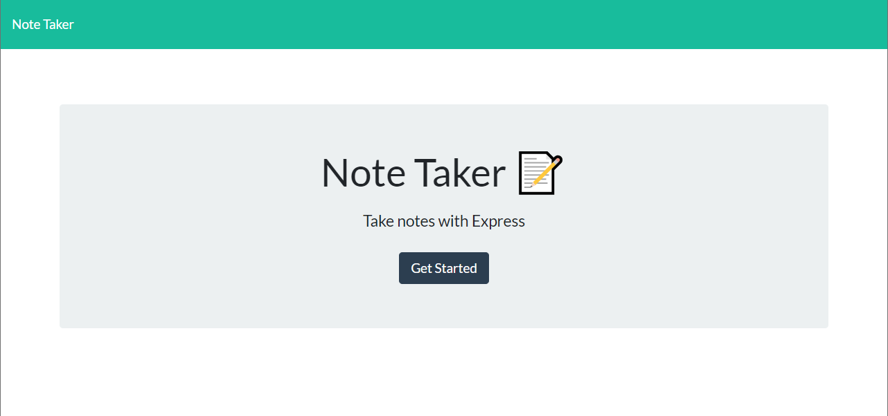
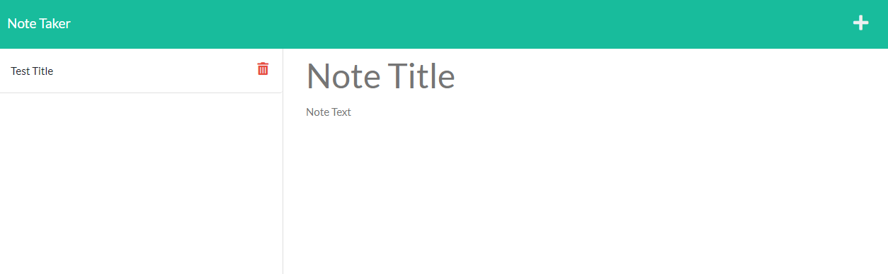

# Note Taker
    
  ## Description 
  An application called Note Taker that can be used to write and save notes. This application will use an Express.js back end and will save and retrieve note data from a JSON file.
  ## Table of Contents
  * [Installation](#installation)
  * [Usage](#usage)
  * [License](#license)
  * [Questions](#questions)
  
  ## Installation 
  To use it locally you will need to install Node.js and Express.js.
  ## Usage 
  Go to the app deployed on [heroku](https://gentle-temple-38295.herokuapp.com/) click on Get Started and add your note title and text. You can delete notes with the red trash can icon.  
  
  
2
  ## License 
  This project is license under [ISC](https://choosealicense.com/licenses/ISC/)
 
  ## Questions
  If you have any questions about this projects, please contact me directly at [c.vazquez1986@gmail.com](mailto:c.vazquez1986@gmail.com).  
  You can view more of my projects at [Clos86](https://github.com/Clos86).
